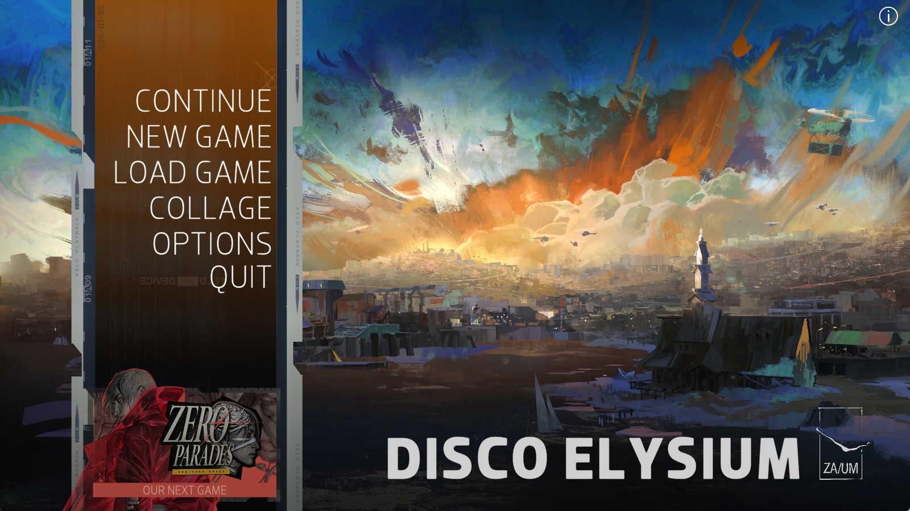
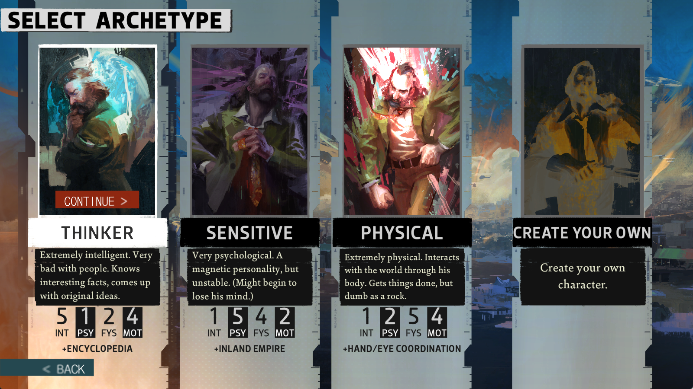

# Preface

## Chapter1. 游戏介绍

```
游戏名：极乐迪斯科
Disco Elysium The Final Cut
```

- **Disco**
  - n. **迪斯科；迪斯科舞厅；复古舞会**
- **Elysium**
  - n. **极乐净土、极乐世界、乐土**
  - 源自希腊神话，指死后善人去往的天堂乐土，高级书面文学词
- **The Final Cut**
  - **最终剪辑版**


## Chapter2. MAIN MENU 主菜单



### 2.1 collage

n. 拼贴画；碎片拼凑的集锦

例句：

The story is a collage of memories. 

这个故事是回忆拼凑成的集锦。

易混：**college** 大学、学院


## Chapter3. SELECT ARCHETYPE



### 3.1 select archetype xuan'ze

- **`select`** (v.)：选择；挑选
- **`archetype`** (n.)：原型；典型；模板

`archetype`  在 `RPG` 游戏里特指**预设的角色 / 职业 / 人格模板**


### 3.2 Thinker 思想派

Extremely intelligent. Very bad with people. Knows interesting facts, comes up with original ideas.

极度聪明，非常不善交际。知晓有趣的事实，能提出新颖的意见。

---

ENCYCLOPEDIA

博学多闻

---

- **`extremely`** (adv.)：**极其、极度、非常**（专门用来**加强语气**，程度比 **very** 强很多）
- **`intelligent`** (adj.)：
  1. **聪慧的、有才智的、悟性高的**（侧重**高智商、逻辑强、善于思考**，不是小聪明）
  2. **智能的**（科技用语）
- **`bad with people`**：形容社交能力差、不懂怎么和人沟通相处。

- **`come up with`**：

  1. **想出、想到**（主意、办法、借口、方案、点子）
  2. **凑出、拿出**（钱、资金）

  

#### 3.2.1 original

adj. 原始的、有新意的、原版的

n.  原作、原著、原版、原件、原稿

**衍生词**

- **origin** n. 起源、出身
- **originally** adv. 起初、原本、本来


#### 3.2.2 encyclopedia

**encyclopedic**  adj. 渊博的、百科全书式的（知识广博）


### 3.3 Sensitive 感性派

Very psychological. A magnetic personality, but unstable. (Might begin to lose his mind.)

非常依赖心理。个性很有吸引力，但很不稳定。（可能会发疯）

---

IRELAND EMPIRE

内陆帝国

---


#### 3.3.1 sensitive

1. **敏感的（情绪/性格）**

   e.g.: She is very sensitive to criticism.

   她对批评很敏感。

2. **敏感的（信息/话题/时间）**

   搭配：sensitive information 机密信息

3. **灵敏的（仪器/感官）**

   搭配：sensitive camera 高灵敏度相机

---

- sense n. 感觉；意识 v. 察觉
- sensible adj. 明智的；合理的
- sensitivity n. 敏感性；敏感度
- insensitive adj. 麻木的；迟钝的

---

- be sensitive to sth 对...敏感
- sensitive area 敏感地区；敏感领域
- sensitive data 涉密数据
- skin sensitive 皮肤敏感

e.g.: Many people are sensitive to social pressure.

很多人对社会压力很敏感

e.g.: Animal are more sensitive to weather changes.

动物对天气变化更灵敏


#### 3.3.2 


### 3.4 Physical

Extremely physical. Interacts with the world through his body. Gets things done, but dumb as a rock.

极端健硕，通过自己的身体与世界互动。能把事情做好，但却笨拙得像块石头。

---

HAND / EYE COORDINATION

眼明手巧

---


# Part One 背景故事


# Part Two 人物介绍