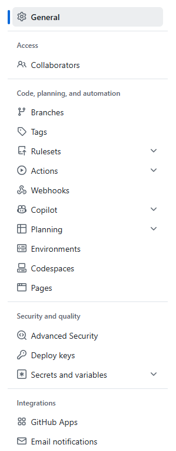

| 单词         | 美式音标         | 中文     |
| ------------ | ---------------- | -------- |
| Overview     | /ˈoʊvərˌvjuː/    | 总览     |
| Repositories | /rɪˈpɑːzətɔːriz/ | 代码仓库 |
| Projects     | /ˈprɑːdʒekts/    | 项目     |
| Packages     | /ˈpækɪdʒɪz/      | 软件包   |
| Stars        | /stɑːrz/         | 星标     |

---

| 英文                 | 美式音标                   | 翻译                 |
| -------------------- | -------------------------- | -------------------- |
| Code                 | /koʊd/                     | 代码                 |
| Issues               | /ˈɪʃuːz/                   | 问题                 |
| Pull requests        | /pʊl rɪˈkwests/            | 拉取请求             |
| Agents               | /ˈeɪdʒənts/                | 智能体               |
| Actions              | /ˈækʃənz/                  | 操作（自动化工作流） |
| Projects             | /ˈprɑːdʒekts/              | 项目                 |
| Wiki                 | /ˈwɪki/                    | 维基（百科页）       |
| Security and quality | /sɪˈkjʊrəti ənd ˈkwɑːləti/ | 安全与质量           |
| Insights             | /ˈɪnsaɪts/                 | 洞察（数据分析）     |
| Settings             | /ˈsetɪŋz/                  | 设置                 |

---

| 英文原文                           | 美式音标                       | 中文翻译                 |
| ---------------------------------- | ------------------------------ | ------------------------ |
| **General**                        | /ˈdʒɛnərəl/                    | 常规设置                 |
| **Access**                         | /ˈæksɛs/                       | 访问权限                 |
| Collaborators                      | /kəˈlæbəˌreɪtərz/              | 协作者                   |
| **Code, planning, and automation** | /koʊd ˈplænɪŋ ænd ˌɔtəˈmeɪʃən/ | 代码、规划与自动化       |
| Branches                           | /ˈbræntʃɪz/                    | 分支                     |
| Tags                               | /tæɡz/                         | 标签                     |
| Rulesets                           | /ˈruːlˌsɛts/                   | 规则集                   |
| Actions                            | /ˈækʃənz/                      | 操作（CI/CD 工作流）     |
| Webhooks                           | /ˈwɛbˌhʊks/                    | 网络钩子                 |
| Copilot                            | /ˈkoʊˌpaɪlət/                  | Copilot（AI 编程助手）   |
| Planning                           | /ˈplænɪŋ/                      | 计划（项目规划）         |
| Environments                       | /ɪnˈvaɪrənmənts/               | 环境                     |
| Codespaces                         | /ˈkoʊdˌspeɪsɪz/                | 代码空间（云端开发环境） |
| Pages                              | /ˈpeɪdʒɪz/                     | 页面（静态网站托管）     |
| **Security and quality**           | /sɪˈkjʊrəti ænd ˈkwɑləti/      | 安全与质量               |
| Advanced Security                  | /ədˈvænst sɪˈkjʊrəti/          | 高级安全                 |
| Deploy keys                        | /dɪˈplɔɪ kiz/                  | 部署密钥                 |
| Secrets and variables              | /ˈsikrəts ænd ˈvɛriəbəlz/      | 机密与变量               |
| **Integrations**                   | /ˌɪntɪˈɡreɪʃənz/               | 集成                     |
| GitHub Apps                        | /ˈɡɪthʌb æps/                  | GitHub 应用              |
| Email notifications                | /ˈimeɪl ˌnoʊtəfɪˈkeɪʃənz/      | 邮件通知                 |